# 🎓 QuizMaster – Quiz Management Platform

QuizMaster is a full-stack web-based Quiz Management Platform designed for creating, managing, attempting, and evaluating quizzes.

The application provides separate **Admin** and **Student** interfaces. Administrators can manage students, categories, quizzes, questions, and quiz results, while students can register, attempt published quizzes within a time limit, track their performance, and review their results.

---

## ✨ Features

### 👨‍💼 Admin Features

- Secure admin authentication
- Admin dashboard with platform statistics
- View and manage registered students
- Activate/deactivate student accounts
- Delete student accounts
- Create, edit, and delete quiz categories
- Create and manage quizzes
- Configure:
  - Quiz category
  - Difficulty level
  - Duration
  - Passing score
  - Maximum attempts
- Publish and unpublish quizzes
- Add, edit, and delete quiz questions
- Configure multiple-choice options and correct answers
- Add explanations for questions
- View completed student attempts
- Search and filter quiz attempts
- View detailed student results
- Review correct, incorrect, and unanswered questions
- Monitor quiz and category performance

### 👩‍🎓 Student Features

- Student registration and login
- Secure JWT-based authentication
- Personalized student dashboard
- Browse available published quizzes
- Search quizzes by title, category, or difficulty
- Filter quizzes by category and difficulty
- View quiz details before starting
- Attempt quizzes with a countdown timer
- Navigate between quiz questions
- Save answers and quiz progress
- Resume an in-progress quiz attempt
- Automatic quiz submission when time expires
- Timer warnings when time is running low
- Maximum attempt restrictions
- Automatic score calculation
- Pass/fail evaluation
- Detailed result summary
- Review correct and incorrect answers
- View explanations for questions
- View previous quiz attempts
- Performance statistics
- Student profile
- Custom profile avatar selection

---

## 🛠️ Tech Stack

### Frontend

- React.js
- Vite
- React Router
- Axios
- CSS

### Backend

- Node.js
- Express.js
- JWT Authentication
- bcrypt

### Database

- PostgreSQL
- Neon PostgreSQL

### Deployment

- Vercel – Frontend
- Render – Backend
- Neon – PostgreSQL Database

---

## 🔐 Authentication & Authorization

QuizMaster uses **JSON Web Tokens (JWT)** for authentication.

The platform separates Admin and Student functionality using protected routes and role-based authorization.

Passwords are securely hashed before being stored in the database.

---

# 📸 Application Screenshots

## 👨‍💼 Admin Portal

### Admin Login

Secure login portal for authorized administrators.

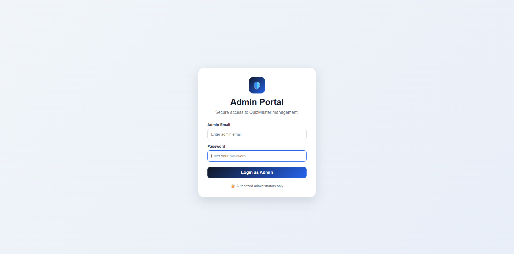

### Admin Dashboard

The Admin Dashboard provides an overview of students, quizzes, questions, attempts, pass/fail statistics, average scores, quiz performance, and category performance.

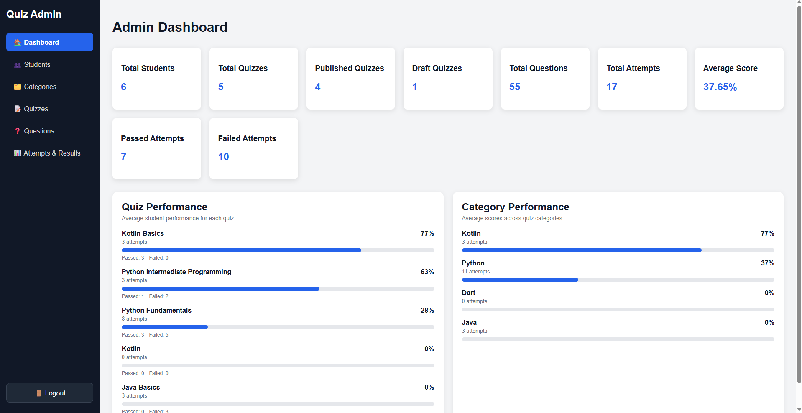

### Student Management

Administrators can view registered students, manage account status, and delete student accounts.

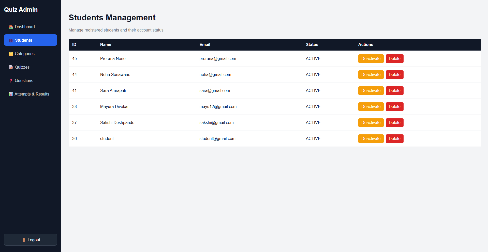

### Category Management

Administrators can create, edit, and delete quiz categories.

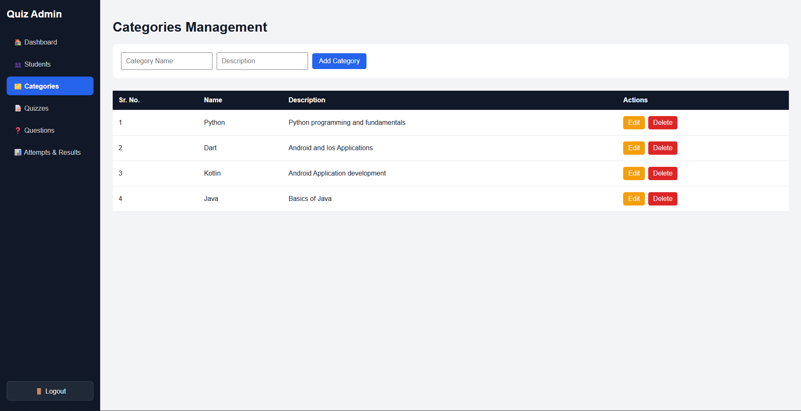

### Quiz Management

Administrators can create quizzes and configure their category, difficulty, duration, passing score, maximum attempts, and publication status.

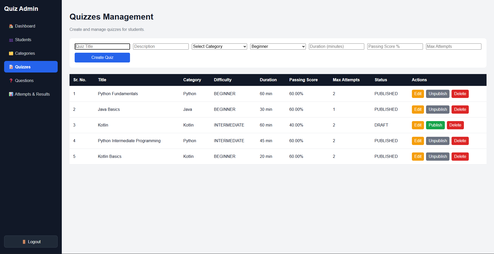

### Question Management

Administrators can add questions, marks, difficulty levels, answer options, correct answers, and explanations.

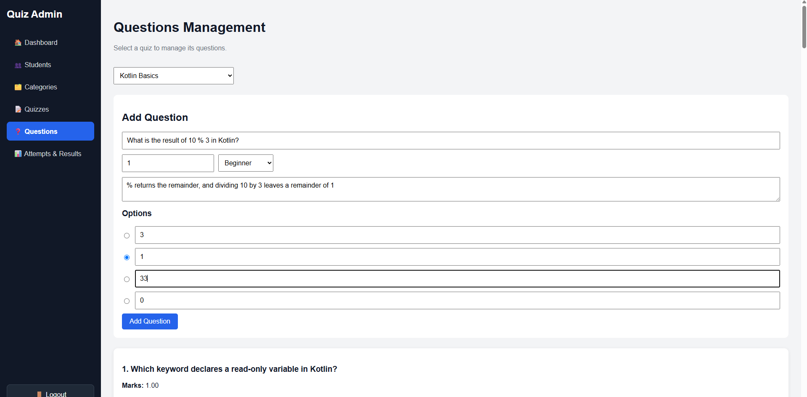

### Attempts & Results

Administrators can monitor completed student attempts and search or filter results.

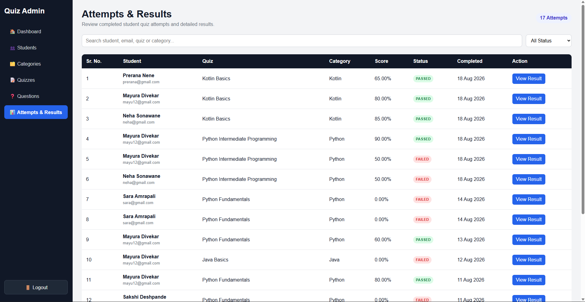

### Detailed Student Result

Administrators can review individual student performance, including score, correct answers, incorrect answers, unanswered questions, time taken, and answer-level details.

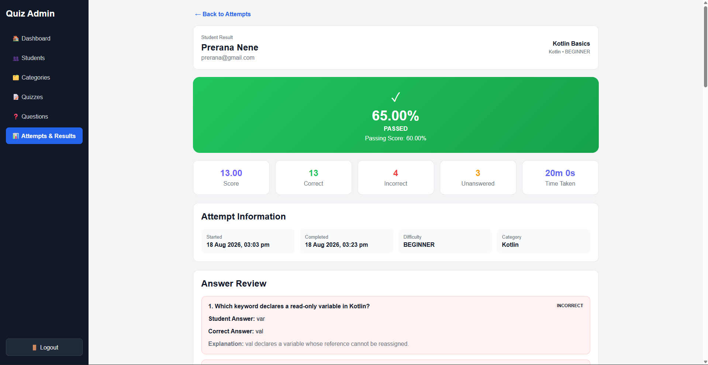

---

## 👩‍🎓 Student Portal

### Student Login

Students can securely log in to access their QuizMaster account.

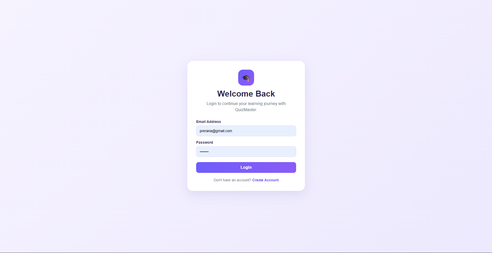

### Student Dashboard

The dashboard displays available quizzes, recent attempts, total attempts, pass/fail statistics, average score, highest score, and performance information.

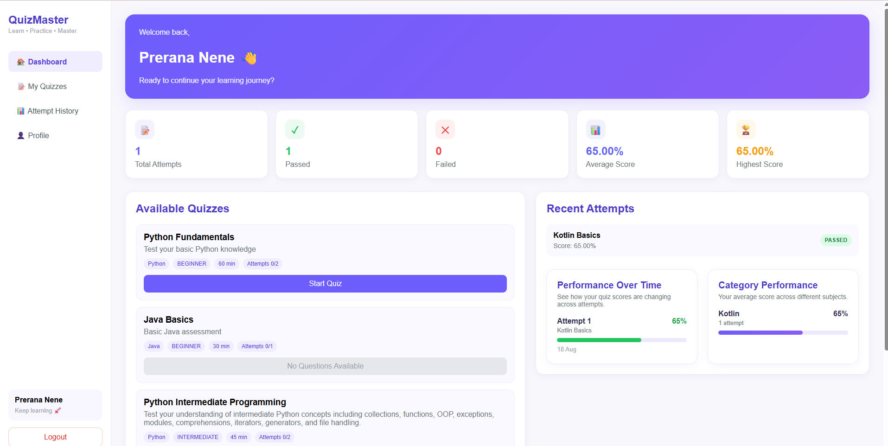

### My Quizzes

Students can browse available quizzes and view their difficulty, duration, passing score, and remaining attempts.

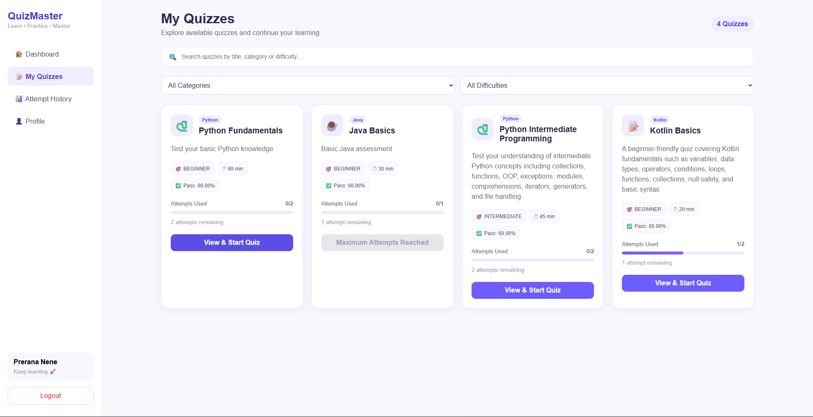

### Quiz Attempt

Students can attempt quizzes through a timed interface with question navigation and a live countdown timer.

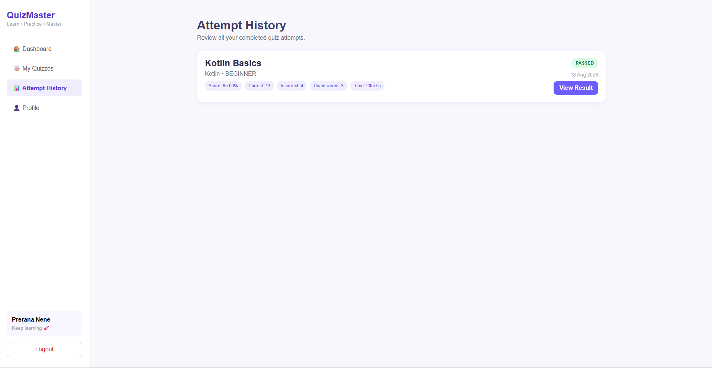

### Quiz Result & Answer Review

After completing a quiz, students receive their score, pass/fail status, correct/incorrect/unanswered counts, time taken, and detailed answer explanations.

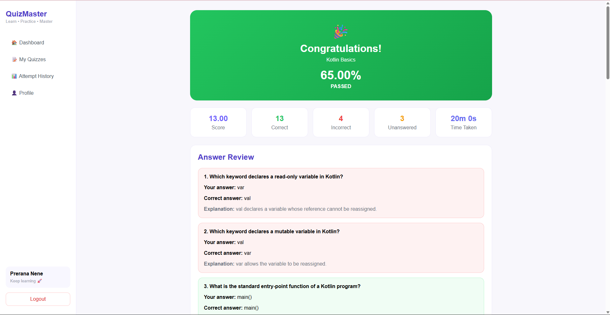

### Student Profile

Students can view their account information and personalize their profile by selecting an avatar.

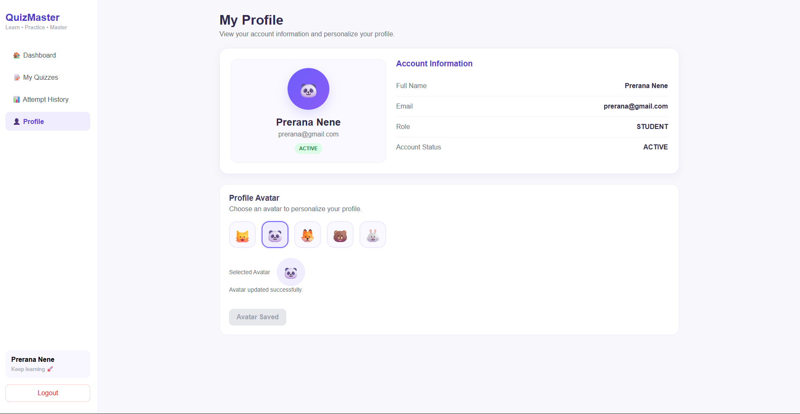

---

## ⚙️ Installation & Setup

### 1. Clone the Repository

```bash
git clone https://github.com/srushtid1805/Quiz-Management-Platform.git
cd Quiz-Management-Platform
```

### 2. Backend Setup

Navigate to the backend directory:

```bash
cd backend
npm install
```

Create a `.env` file inside the `backend` folder:

```env
PORT=5000
DATABASE_URL=your_postgresql_database_url
JWT_SECRET=your_jwt_secret
```

Start the backend server:

```bash
npm run dev
```

### 3. Frontend Setup

Open another terminal and navigate to the frontend directory:

```bash
cd frontend
npm install
```

Create a `.env` file inside the `frontend` folder:

```env
VITE_API_BASE_URL=http://localhost:5000/api
```

Start the frontend:

```bash
npm run dev
```

---

## 📁 Project Structure

```text
quiz-management-platform/
│
├── backend/
│   ├── config/
│   ├── controllers/
│   ├── middleware/
│   ├── models/
│   ├── routes/
│   └── server.js
│
├── frontend/
│   ├── public/
│   ├── src/
│   │   ├── components/
│   │   ├── pages/
│   │   └── services/
│   └── package.json
│
├── screenshots/
│   ├── admin-login.png
│   ├── admin-dashboard.png
│   ├── admin-students.png
│   ├── admin-categories.png
│   ├── admin-quizzes.png
│   ├── admin-questions.png
│   ├── admin-attempts.png
│   ├── admin-result-details.png
│   ├── student-login.png
│   ├── student-dashboard.png
│   ├── student-quizzes.png
│   ├── student-quiz-attempt.png
│   ├── student-result.png
│   └── student-profile.png
│
└── README.md
```

---

## 🔒 Environment Variables & Security

Sensitive information such as database credentials, JWT secrets, and administrator credentials is **not stored in this repository**.

Environment variables should be configured using `.env` files and deployment environment settings.

Admin credentials are shared privately with authorized reviewers when required.

---

## 🚀 Deployment

The application is deployed using:

- **Frontend:** Vercel
- **Backend:** Render
- **Database:** Neon PostgreSQL

### Live Application

- 🌐 [Open QuizMaster](https://quiz-management-platform-nine.vercel.app)
- ⚙️ **Backend API:** https://quiz-management-platform-9d5d.onrender.com
- 💻 **GitHub Repository:** https://github.com/srushtid1805/Quiz-Management-Platform

---

## 👩‍💻 Author

**Srushti Deshpande**

Full Stack Development Project